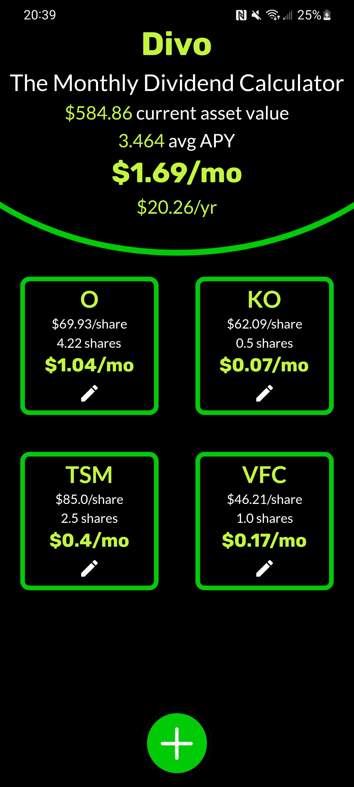
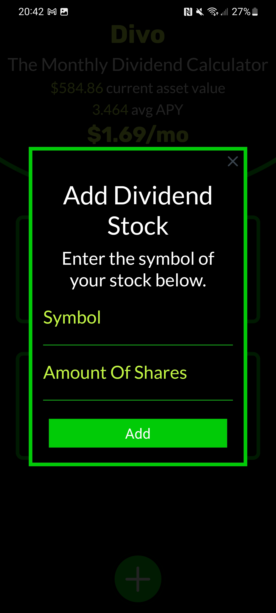

<h1 align="center">
   
  
   
  Divo
   
</h1>

<h4 align="center">A simple yet useful monthly dividend estimate calculator</h4>

  <a href="#key-features">Key Features</a> •
  <a href="#demo">Demo</a> •
  <a href="#license">License</a>

<h1 align="center">

</h1>

## Key Features

* App
  * Estimate Average monthly dividend estimate
  * Estimate Yearly dividend income
  * Estimate value of dividend portfolio
  * Saves data to local device
* Backend api
  * Caching functionality

## Technologies Used
* App
  * Flutter
  * Dart
  * Android
  * iOS
  * Serialisation
* Api
  * Python
  * Flask
  * yahoo-finance package
  * json
  * Caching

## Demo

<h1 align="center">

</h1>

## License

MIT

---
> [zlincoln.dev](https://www.zlincoln.dev) &nbsp;&middot;&nbsp;
> GitHub [@ZacharyLincoln](https://github.com/ZacharyLincoln)

